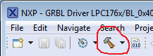

## LPC176x grblHAL driver

A GrblHAL driver for NXP LPC1768 and LPC1769 processors.

Loosely based on the official [grbl-LPC port](https://github.com/gnea/grbl-LPC).

See the Wiki-page for [compiling grblHAL](https://github.com/terjeio/grblHAL/wiki/Compiling-GrblHAL) for instructions for how to import the project, configure the driver and compile.

Available driver options can be found [here](src/my_machine.h).

__Update 2020-12-11:__
* Added initial board map file for Bigtreetech SKR V1.3 Turbo board.

__Update 2020-11-21:__
* Added initial board map file for [BTT SKR V1.4 Turbo board](https://www.bigtree-tech.com/products/btt-skr-v1-4-skr-v1-4-turbo-32-bit-control-board.html).
* Added polling of limit switches, enabling hard limits is now possible.

A build option for creating a _Firmware.bin_ file that can be used for programming via the Smoothieboard DFU-bootloader has been added to build configurations.  
Select the _BL_0x4000_ configuration from the build tool dropdown to build, and programming can then be done via SD card transfer:  
  
_Firmware.bin_ is found in the _BL_0x4000_ project folder after a successful build.

__Update 2020-01-01:__

* Added [board map](./Re-ARM%20Shield%20pin%20mappings/ramps_1.6_map.md) file for [Ramps 1.6](https://reprap.org/wiki/RAMPS_1.6) on [Re-ARM board](https://www.panucatt.com/Re_ARM_for_RAMPS_p/ra1768.htm) hacked for programming via Segger J-Link. Improved pin assignment handling and fixed some bugs. USB comms and SD card seems to be working ok for this board, however only limited testing done.

__Update 2019-08-08:__

* Changed IDE to [MCUXpresso v11](https://www.nxp.com/design/software/development-software/mcuxpresso-software-and-tools/mcuxpresso-integrated-development-environment-ide:MCUXpresso-IDE) and linked against [LPCOpen development platform](https://www.nxp.com/design/microcontrollers-developer-resources/lpcopen-libraries-and-examples/lpcopen-software-development-platform-lpc17xx:LPCOPEN-SOFTWARE-FOR-LPC17XX) libraries. I2C EEPROM on [OM13085 LPCXpresso board](https://www.nxp.com/design/microcontrollers-developer-resources/lpc-microcontroller-utilities/lpcxpresso-board-for-lpc1769-with-cmsis-dap-probe:OM13085) and SD card supported. 

---
2020-12-11
