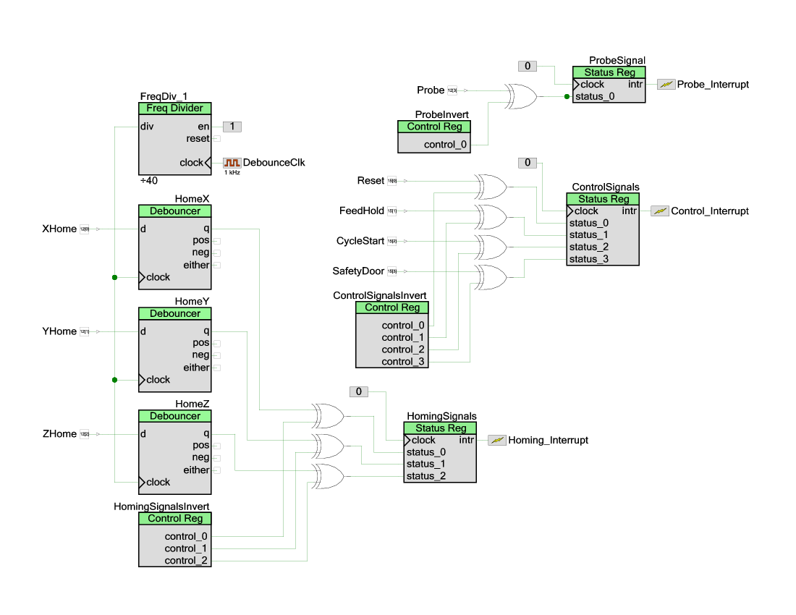

## PSoC5 Driver

A GrblHAL driver for Cypress PSoC 5 \(CY8CKIT-059\

** EXPERIMENTAL **

Features:

* All hardware dependent code in this project. In order to compile this projects requires my HALified Grbl library to be added, either directly to this project or as a dependency.

Some of the program logic is moved to UDBs, typically signal inversions.

**NOTE:** currently only tested on a CY8CKIT-059 prototyping kit with an oscilloscope to verify some signals. No motors connected yet!

---

#### How to set up build environment

Unzip the driver code to your workspace and rename the "PSoC5GrblDriver-master" folder to "GRBL Driver PSoC5.cydsn".

Select *File > Add Exisiting Project...* to add it to the workspace.

Create a new project with *File > Create project...* as a *Library project* and name it "GRBL Library" (or whatever name you fancy).

Copy the .c and .h files from the [grbl library](https://github.com/terjeio/grblHAL/GRBL) to the newly created project folder.

Rigth click the new project and select *Add Existing Item...* , navigate to the new project folder and select all .c and .h files. Right click the GRBL Driver PSoC5 project and select *Dependencies...* , in the dialog that appears tick the *Code* box for the GRBL Library.

---

Some parts of the code has been moved to UDBs resulting in simpler code and less overhead:

