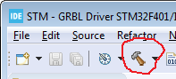

## STM32F4xx grblHAL driver

A grblHAL driver for the STM32F401xC, STM32F407xx, STM32F411xE and STM32F446xx ARM processors.

Loosely based on code from robomechs [6-AXIS-USBCNC-GRBL](https://github.com/robomechs/6-AXIS-USBCNC-GRBL) port, updated for [STM32CubeIDE](https://www.st.com/en/development-tools/stm32cubeide.htm) and the latest STM HAL drivers where appropriate.

See the Wiki-page for [compiling grblHAL](https://github.com/terjeio/grblHAL/wiki/Compiling-GrblHAL) for instructions for how to import the project, configure the driver and compile.

Available driver options can be found [here](Inc/my_machine.h).

Select the processor to build for from the build tool dropdown to build. The `.bin` created file can be found in the folder with the same name as the menu name when the build is completed.  

A method for flashing the Nucleo F411 and Nucleo F446 is to drop the `.bin` file on the NODE_F4xxRE flash drive. Note that the file can be dragged from the IDE _Project Explorer_.

__NOTE:__ Internal flash page for parameters is not at the end of the flash memory due to size restrictions. This means each firmware upgrade will erase any saved parameters. 

---

If compiling for debugging, edit symbols in project properties _C\/C++ General > Paths and Symbols > Symbols_ to match your processor/board.

Remove symbols starting with `STM32F4`, starting with `NUCLEO_F4` and `HSE_VALUE`. Then add symbols:

#### STM32F401

* Add `STM32F401xC`.

#### STM32F407

* Add `STM32F407xx`.

#### STM32F411

* Add `STM32F411xE`.

* If compiling for the [Nucleo F411RE development board](https://www.st.com/en/evaluation-tools/nucleo-f411re.html) add `NUCLEO_F411`.

#### STM32F446

* Add  `STM32F446xx`.

* If compiling for the [Nucleo F446RE development board](https://www.st.com/en/evaluation-tools/nucleo-f446re.html) add `NUCLEO_F446`.

If the oscillator frequency is different from the default 25 MHz then add the symbol `HSE_VALUE` and set the value to the frequency in Hz. E.g. `8000000` for 8 Mhz.

---

CNC breakout boards:

[Minimal breakout for Blackpill](https://github.com/avizienis/Minimal-Black-Pill--STM32F4xx-BOB-for-grblHAL) by avizienis.

[CNC breakout for Nucleo-64](https://github.com/terjeio/CNC_Breakout_Nucleo64) by Terje Io.

---
2021-02-19
