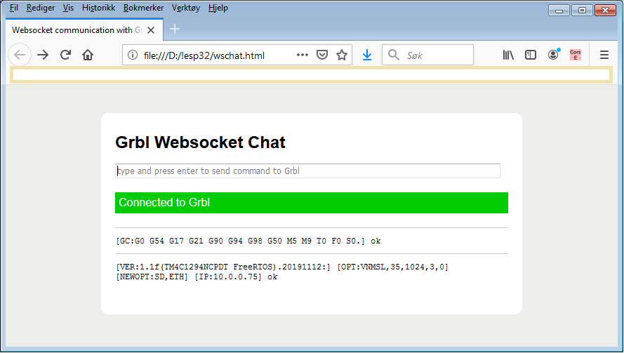

## Networking services plugin

This plugin contains code for "stream based" network protocol support on top of the lwIP TCP/IP stack plus some utilities.

"stream based" in this context means that the HAL entry points for streaming are used as the API \(by dynamic pointer swapping on connect\).

#### Protocols supported:

* Telnet ("raw" mode)  
* Websocket - work in progress, initial test results are promising.  

#### Dependencies:

[lwIP library](http://savannah.nongnu.org/projects/lwip/)

#### Credits:

Parts of WsStream.c are pulled from [patch 9525](http://savannah.nongnu.org/patch/?9525) by Sakari Kapanen.

base64.c, sha1.c by Brad Conte, pulled from from the same patch as mentioned above.

[multipartparser.c](https://github.com/francoiscolas/multipart-parser) by François Colas. 

wschat.html modified from original by [tutorialspoint.com](https://www.tutorialspoint.com/websockets/websockets_javascript_application.htm), for simple websocket testing \(edit line 103 to set address and port before use\).

__NOTE:__ some drivers uses ports of lwIP provided by the MCU supplier.  
__NOTE:__ this plugin is only for the protocol layer. Driver specific code is required for initialising lwIP and start/stop/polling the services.

---
#### Simple websocket test app:

---
2019-11-23
